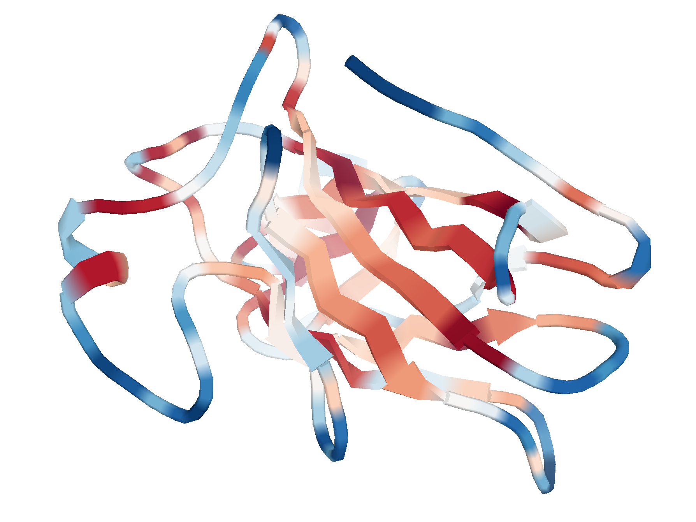

# Protein Amino Acid Topology Analysis and Visualization

This repository provides tools for analyzing amino acid topology from protein structures and visualizing the results using PyMOL. The study introduces a computational framework based on protein structural topology features (Contact Flexibility, Local Density, and CF-Force Polarity Index) to explain how amino acid variations affect protein expression, stability, post-translational modifications, and clinical variant interpretation.

## 📁 Repository Structure

```
AA_topology/
├── a.resource/                 # Input data 
├── 0.script/                 
│   ├── _plot_fig.R           # Plotting functions
│   ├── _DN_function.R        # Distance neighbor functions
│   ├── 2.1.dms_CYP2C9_proc.R  # Protein expression and DMS analysis
│   ├── 2.2.dms_NUDT15_proc.R
│   ├── 2.3.dms_PTEN_proc.R
│   ├── 2.4.dms_TPMT_proc.R
│   ├── 2.5.dms_domain500.R
│   ├── 3.0.Global_TopoTrend_AA_analysis.R # Global amino acid distribution and evolution analysis
│   ├── 3.5.paralog_sites_AF2_topo.R
│   ├── 4.0.plot_density_proteome_topo.R
│   ├── 4.1.SFI_deltaG.R   # Structural Fragility Index (SFI) analysis
│   ├── 4.2.SFI_human_protein_HL.R
│   ├── 4.3.SFI_mouse_protein_HL.R
│   ├── 4.4.SFI_protein_sublocation.R
│   ├── 5.0.topo_ClinGen.R    ## Clinical variant analysis (ClinGen & ClinVar)
│   ├── 5.1.topo_ClinVar.R
│   ├── 6.0.Uniprot_PTM_topo.R  # PTM analysis
│   ├── 6.1.turnover_Ub_acc.R
│   ├── 6.2.turnover_Phos_acc.R
│   ├── 6.3.AD_Phos_acc.R   # Alzheimer's disease analysis
│   ├── 7.0.tcga_topo_proc.R   # Clinical data processing
│   ├── 7.1.tcga_rd_response.R
│   ├── 7.2.plot_TCGA_other_interval.R   # TDDA analysis in cancer
│   ├── 7.3.plot_TDDA_cor.R
│   ├── 7.4.TCGA_ASPD_count_ROC.R
│   ├── 7.5.TCGA_ASPD_count_survival.R
│   └── 7.6.TCGA_ASPD_0-1_survival.R

├── b.Protein_expression/      # Protein expression and DMS analysis
├── c.Global_analysis/         # Global amino acid distribution and evolution analysis
├── d.SFI/                     # Structural Fragility Index (SFI) analysis
├── e.Clinical_SNVs/           # Clinical variant analysis (ClinGen & ClinVar)
├── f.PTM&AD/                  # Post-translational modifications and Alzheimer's disease analysis
├── g.Cancer/                  # TDDA analysis in cancer
├── o.output_figures/          # Generated figures

```

---

## 1️⃣ System Requirements

### Operating System
- **Linux** 
- Tested on: Rocky Linux 8.7 

### Software Dependencies
- **R** (version 4.1.3)

### R Package Dependencies (Key Versions)
| Package | Version | 
|---------|---------|
| `ggplot2` | 3.5.1 |
| `dplyr` | 1.1.4 |
| `bio3d` | 2.4.4 |
| `ggpubr` | 0.6.0 | 
| `stringr` | 1.5.0 |
| `tidyr` | 1.3.1 | 
| `reshape2` | 1.4.4 |
| `ggrepel` | 0.9.6 |
| `pROC` | 1.18.5 |
| `ggdensity` | 1.0.0 |
| `ggpubr` | 0.6.0 |
| `survival` | 3.7.0 |
| `survminer` | 0.4.9 |

### Hardware Requirements
- **Memory**: ≥ 16 GB (64 GB recommended for full proteome analysis)
- **Storage**: ≥ 50 GB (for input data and output files)
- **CPU**: 4+ cores (8+ recommended)

---

## 2️⃣ Installation Guide

### Step 1: Clone the Repository
```bash
git clone https://github.com/YingLiu-1212/AA_topology.git
cd AA_topology
```

### Step 2: Install R and Dependencies
```r
# Install required R packages
install.packages(c("ggplot2", "dplyr", "bio3d", "ggpubr", "stringr", 
                   "tidyr", "reshape2", "ggrepel", "pROC", 
                   "RColorBrewer", "ggdensity"))
```

---

## 3️⃣ Demo (NUDT15 DMS Analysis)

### Step 1: Prepare Data
Ensure the following files exist in `a.resource/NUDT15/`:
- `DMS_NUDT15_abundance.txt`
- `AA_topology_AF-Q9NV35-F1-model_v4_chains.csv`

### Step 2: Run the Script
```bash
cd 0.script
Rscript 2.2.dms_NUDT15_proc.R
```

### Step 3: Check Output
The script will generate:
- `dms_topo_NUDT15.csv` (processed data table)
- `../o.output_figures/DMS_NUDT15.pdf` (scatter plots of CF10/LD15 vs. expression/activity scores)

### Expected Runtime
- **Data preparation**: < 1 minute
- **Script execution**: ~2 minutes
- **Total time**: ~3 minutes

---

## 4️⃣ Instructions for Use

### Running Other Analyses
Each script is an independent module. Run them as:
```bash
cd 0.script
Rscript [script_name].R
```

### **Analysis Modules**
Each numbered directory corresponds to a main figure in the paper:
- **b.Protein_expression**: DMS analysis
- **c.Global_analysis**: Amino acid distribution and evolution
- **d.SFI**: Structural Fragility Index calculations 
- **e.Clinical_SNVs**: Clinical variant analysis 
- **f.PTM&AD**: PTM and Alzheimer's disease
- **g.Cancer**: Cancer metastasis and TDDA 

---

## 5️⃣ Reproducing Paper Results

### Step 1: Environment and Data Setup
- Install R and all dependencies
- Download all data 
- Extract all compressed directory

### Step 2: Run Scripts in Order (Recommended)
```bash
cd 0.script
Rscript [script_name].R
```


### Step 3: Verify Output
Outputs are saved in:
- CSV files in each module directory (data tables)
- PDF files in `o.output_figures/` (figures)

### Estimated Total Runtime
- ~4–6 hours (depends on CPU and memory)

---

## 📊 Output File Descriptions

| File Type | Description | Example |
|-----------|-------------|---------|
| `.csv` | Processed data tables | `dms_topo_NUDT15.csv` |
| `.pdf` | High-quality figures | `DMS_NUDT15.pdf` |
| `.rdata` | R data objects (intermediate) | `AF2_AA_TopoTrend_dedup.rdata` |

---

# To Analyze Your Own Protein

## Tools

1. **AA_TopoAttr.R** - An R script that calculates various amino acid topology features from PDB files
2. **pymol_visualization.py** - A PyMOL script for visualizing the calculated topology properties


### Topology Analysis (AA_TopoAttr.R)
- Calculates contact flexibility (CF) metrics 
- Computes local density (LD) measures
- Generates quantile-scaled (QS) versions of all metrics
- Calculates CF-Force Polarity Index (CF-FPI) metrics
- Outputs tab-separated files with comprehensive topology attributes

### Visualization (pymol_visualization.py)
- Creates protein structure visualizations
- Colors protein chains based on selected topology properties
- Uses Red-Blue (RdBu) color scheme for intuitive value representation
- Customizable cartoon representation with smooth rendering
- High-resolution output (2400×2400 pixels)


### Calculate Topology Attributes

Run the R script with a PDB file:

```bash
Rscript AA_TopoAttr.R <input_pdb_file> <output_directory>
```

**Example:**
```bash
Rscript AA_TopoAttr.R pymol_demo/1ycs.pdb pymol_demo/
```

This generates a topology attribute file: `AA_TopoAttr_1ycs.txt`

## Visualize in PyMOL

1. Open PyMOL
2. Load and run the visualization script:
```python
run pymol_visualization.py
```

### Customizing Visualization

Edit the user-configurable parameters in `pymol_visualization.py`:

```python
# ===================== User-configurable parameters =====================
gene_name = 'TP53'
pdb_id = '1ycs'
chain_id = 'A'
plot_var = 'CF10QS'  # Options: CF10, CF10QS, LD15, LD15QS, CF10QS_FPI

project_dir = 'your/project/directory/'

MIN_VALUE = -1
MAX_VALUE = 1  
# =======================================================================
```

## Output Files

### Topology Analysis Output
- `AA_TopoAttr_<pdb_id>.txt` - Tab-separated file containing:
  - Basic information (chain, position, amino acid)
  - Contact flexibility metrics (CF10, CF10QS)
  - Local density metrics (LD15, LD15QS) 
  - CF-Force Polarity Index (CF10QS_FPI)

### Visualization Output
- `<pdb_id>_<property>_<chain>.png` - High-quality protein visualization

## Example


*Figure 1: Visualization of CF10QS topology property for chain A of 1ycs PDB structure. Red regions indicate lower contact flexibility, Blue regions indicate higher contact flexibility.*


## ✅ License

This project is open-source under the MIT License. See [LICENSE](LICENSE) for details.

---

